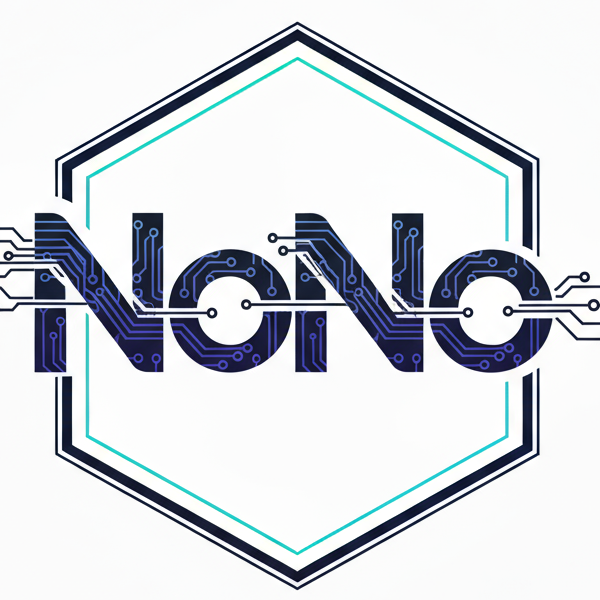
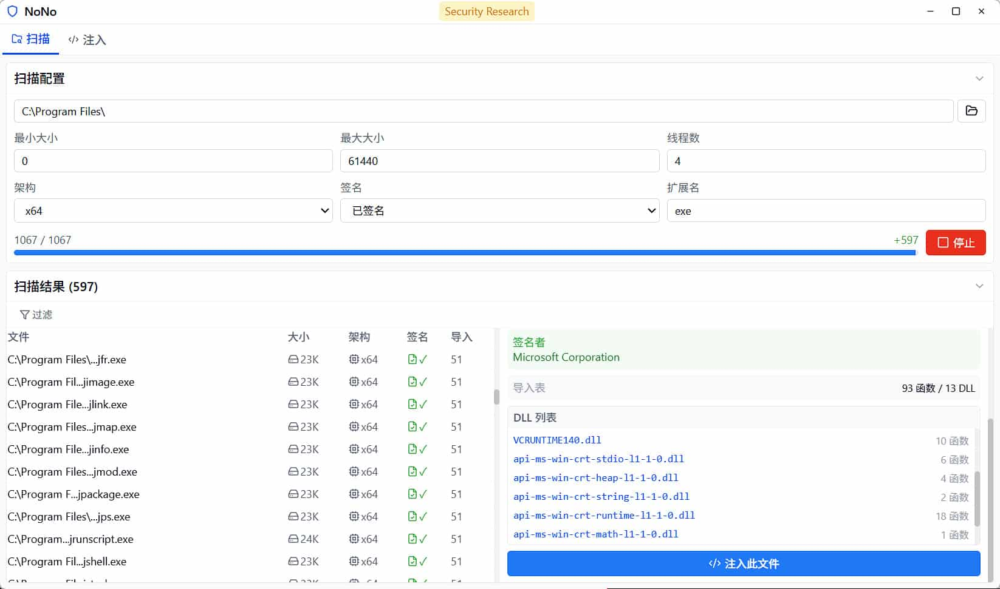
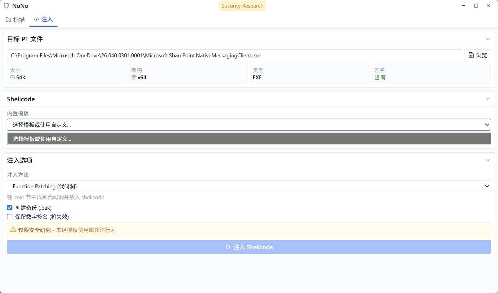

# NoNo

> [!WARNING]
> 本工具仅供安全研究人员、网络管理员及相关技术人员进行授权的安全测试、漏洞评估和安全审计工作使用。使用本工具进行任何未经授权的网络攻击或渗透测试等行为均属违法，使用者需自行承担相应的法律责任。
>
> This tool is for authorized security research, vulnerability assessment, and security auditing only.

NoNo 是一个 PE 文件扫描器和代码注入工具，用于安全研究。







## 功能特性

- **PE 文件扫描**: 查找可被 patch 的小型签名可执行文件
- **结果过滤**: 支持按文件名、签名状态、架构过滤扫描结果
- **代码注入**: 4 种注入方法 (Function, EntryPoint, TLS, EAT)
- **内置模板**: 提供测试用的 shellcode 模板
- **数字签名**: 签名验证和处理
- **GUI & CLI**: 同时提供图形界面和命令行界面
- **现代 UI**: 无框窗口、自定义标题栏、紧凑布局

## 项目结构

```
NoNo/
├── cmd/
│   └── nono-cli/          # CLI 入口
├── internal/
│   ├── scanner/           # PE 扫描模块
│   ├── injector/          # 代码注入模块
│   └── config/            # 配置管理
├── frontend/              # Wails 前端 (React + TypeScript + TailwindCSS)
├── main.go                # Wails 入口
├── app.go                 # Wails 应用绑定
└── wails.json             # Wails 配置
```

## 构建

### 前置要求

- Go 1.18+
- Node.js 16+
- Wails CLI v2.11+

```bash
# 安装 Wails CLI
go install github.com/wailsapp/wails/v2/cmd/wails@latest

# 安装前端依赖
cd frontend && npm install
```

### CLI 版本

```bash
go build -o build/nono-cli.exe ./cmd/nono-cli
```

### GUI 版本

```bash
wails build
```

## 使用方法

### GUI 模式

```bash
# 开发模式
wails dev

# 运行构建后的程序
.\build\bin\NoNo.exe
```

GUI 提供两个主要功能：

### 扫描模块

- 目录选择和扫描配置
- 实时扫描进度显示
- **结果过滤**: 按文件名搜索、签名状态、架构过滤
- 文件详情面板（路径、大小、架构、签名信息、导入表）
- DLL 导入列表查看

### 注入模块

- 目标 PE 文件选择和信息预览
- Shellcode 选择（内置模板或自定义文件）
- 4 种注入方法可选
- 签名处理选项（保留/清除）
- 自动备份原文件

### CLI 模式

```bash
.\build\nono-cli.exe -h
Usage:
  -arch string
        架构: x86, x64, both (default "x64")
  -dir string
        扫描目录 (default "C:\\Program Files\\")
  -ext string
        扩展名 (comma-separated) (default "exe")
  -imports
        显示导入表信息 (default true)
  -max int
        最大文件大小 (default 61440)
  -min int
        最小文件大小
  -sign string
        签名过滤: signed, unsigned, all (default "signed")
  -workers int
        线程数 (default 4)
```

示例:
```bash
.\build\nono-cli.exe -dir "C:\Program Files" -arch x64 -sign signed -max 50000
```

## Shellcode 模板

NoNo 内置了测试用的 shellcode 模板：

| 模板 | 描述 |
|------|------|
| `template_0` | MessageBox 测试 shellcode |
| `template_1` | 文件读取 shellcode |

### 使用模板

1. 打开 GUI 程序
2. 进入 **注入** 标签页
3. 从下拉菜单选择模板或选择自定义 shellcode 文件
4. 选择目标 PE 文件
5. 选择注入方法和选项
6. 点击 **注入 Shellcode**

## 注入方法

1. **Function Patching**: 在 .text 节中找到代码洞并放入 shellcode
2. **Entry Point Hijacking**: 修改入口点直接执行 shellcode
3. **TLS Injection**: 使用 TLS 回调在主入口点之前执行代码
4. **EAT Patching**: 修补导出函数地址 (仅 DLL)

## 工作流程

### 1. 查找可 Patch 的文件

使用 GUI 或 CLI 扫描适合的目标文件：
- 小型可执行文件 (< 100KB)
- 有数字签名
- 依赖 DLL 少
- 高信誉文件

### 2. 准备 Shellcode

选项 A: 使用内置模板测试
选项 B: 生成自定义 shellcode:
```bash
# 使用 sgn 编码
sgn.exe -a 64 -i shellcode.bin -o encoded.bin

# 使用 Shoggoth
Shoggoth.exe -i shellcode.bin -o obfuscated.bin
```

### 3. 注入 Shellcode

使用 GUI:
1. 选择目标 PE 文件
2. 选择 shellcode (模板或自定义)
3. 选择注入方法
4. 配置选项 (备份、签名)
5. 点击注入

## 技术细节

- **PE 解析**: 使用 `github.com/Binject/debug/pe` 进行扩展 PE 功能
- **签名验证**: 通过 syscall 调用 Windows CryptoAPI
- **并发扫描**: 使用 worker pool 模式进行并行扫描
- **事件驱动**: Go 后端通过事件机制与前端通信
- **前端**: React 18 + TypeScript + TailwindCSS + Lucide Icons
- **后端**: Go 1.24 + Wails v2.11
- **窗口**: 无框窗口设计，支持 CSS 拖拽

## 检测注意事项

- 修改后的 PE 文件可能触发杀软
- 内存扫描器可检测注入代码
- 行为分析可能标记可疑模式
- 修改后文件哈希会改变

## 参考资料

+ **师承鬼屋女鬼**
+ [BinHol](https://github.com/timwhitez/BinHol) - 原始注入工具
+ [sgn](https://github.com/EgeBalci/sgn) - Shellcode 编码器
+ [Shoggoth](https://github.com/frkngksl/Shoggoth) - 高级 shellcode 混淆器
+ [检测方法](https://key08.com/index.php/2024/08/03/1949.html)

## 许可证

仅供授权安全研究和教育目的使用。
